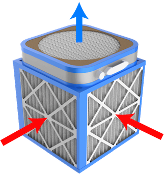

In this design, polluted air is sucked in through the filters on the sides of the cube and clean air is blown up out of the top. Blowing upward substantially increases air mixing in the room, ensuring that the room's air is cleaned faster. This particular design is often called a "Corsi-Rosenthal cube" or something similar because it was popularized by two scientists with those names in the early pandemic. It has been a staple in the DIY and woodworking scenes for a long time because of its relative cheapness and high efficacy.

## Materials
- One box fan (20" x 20" / 50cm x 50cm is common)
- Four ≥ MERV 13 furnace filters, close to the box fan in size
- Duct tape, painters tape, or any other tape which is relatively stable and air-tight
- Scissors
- Spare cardboard (if you purchased the box fan new, it probably came with the perfect box)

## Construction steps

{}

### Assemble sides

Tape the filters into a cube shape, pointing the arrows on the edges of the filters inward

- The arrows indicate air flow direction

### Add the bottom

Tape a sheet of cardboard to the bottom to cover it

- Using one of the large faces of the box fan's box is common

### Place the fan on top

Tape the box fan to the top, such that it blows upward away from the cube

- Watch for the cord - if necessary you may need to construct a pass-through for it, which should be sealed well with tape to prevent unfiltered intrusion

### Cover up seams

Totally close all seams in the construction with tape

### Cover the top corners

Cover the corners of the fan's face

- This prevents unfiltered air from circulating through the fan, because box fans will draw air in at their corners (where the blades don’t reach)
- A popular solution is to cut a circle out of the other large cardboard face from the box fan's box, but you can also just tape over the corners and edges - some coverage of the blades is preferable to leaving any of the void space uncovered

{}

Check out [Clean Air Crew](https://cleanaircrew.org/box-fan-filters/) for illustrated guides, video guides, and further resources.