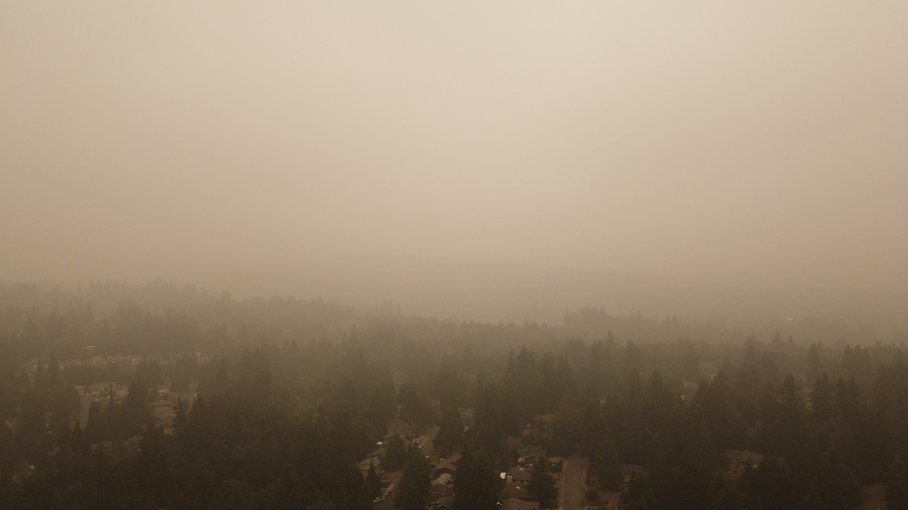

## A brief note

You may not consider all of the tips discussed to be appropriate for you. We all have different risk profiles and protection available to us. Some tips are better suited to heavier local smoke than you may be experiencing, while others are best utilized when a smoke event occurs alongside a heat event, which is common in the west.

In addition, any action you take which mitigates your risk is better than taking no action, regardless of its absolute efficacy. The more mitigation you undertake, the better off you will be - this has been called the “swiss cheese” defense model. So picking and choosing is quite valid! Nevertheless, please keep track of the AQI in your area, and be aware that for the particulates it measures there is no safe level of exposure for anyone in any condition.